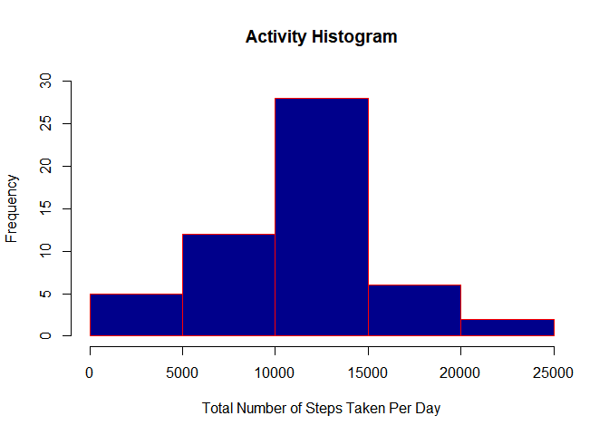
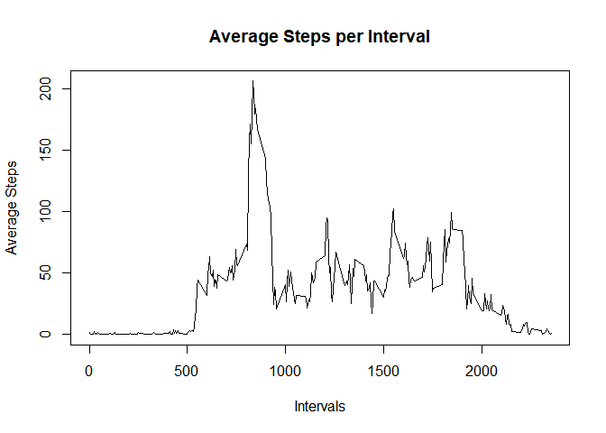

#### Load all the required libraries

#### Download the project data to the set directory and unzip the file

    URL<-'https://d396qusza40orc.cloudfront.net/repdata%2Fdata%2Factivity.zip'
    download.file(URL, destfile = 'C:\\Users\\asten\\Documents\\Mini\\Data_science_training\\Reproducible_Research\\week2\\CourseProject1\\Activity_Monitoring_Data.zip', method='auto')
    unzip('Activity_Monitoring_Data.zip')

#### Load the Project dataset

    Activity_Monitoring_Data <- read.csv("activity.csv")

#### **1. Calculate the total number of steps**

    Total_No_of_Steps<-aggregate(Activity_Monitoring_Data['steps'], by=Activity_Monitoring_Data['date'], sum)

#### **1.1. Make a histogram of the total number of steps taken each day**

    hist(Total_No_of_Steps$steps,freq = TRUE,
         xlim=c(0,25000), ylim=c(0,30),
         xlab = "Total Number of Steps Taken Per Day", 
         ylab = "Frequency", main = "Activity Histogram", 
         col = "darkblue", border = "red")

#### **1.2. Calculate and report the mean and median of the total number of steps taken per day.**

    summary(Total_No_of_Steps$steps)

    ##    Min. 1st Qu.  Median    Mean 3rd Qu.    Max.    NA's 
    ##      41    8841   10765   10766   13294   21194       8

#### As can be seen from the summary table above the mean is 10766 and the median is 10765

#### **2. Make a time series plot (i.e. type = "l"') of the 5-minute interval (x-axis) and the average number of steps taken, averaged across all days (y-axis)**

    Avg_interval_steps<-with(Activity_Monitoring_Data,tapply(steps,interval,mean,na.rm=TRUE))
    Intervals<-unique(Activity_Monitoring_Data$interval)
    New_data<-data.frame(cbind(Avg_interval_steps,Intervals))

#### The time series plot of the 5-minute interval steps

    plot(New_data$Intervals,New_data$Avg_interval_steps,type = "l",xlab = "Intervals",
         ylab = "Average Steps",main = "Average Steps per Interval")

#### **2.1. Which 5-minute interval, on average across all the days in the dataset, contains the maximum number of steps?**

    Max_no_steps<- max(New_data$Avg_interval_steps)

    subset(New_data, Avg_interval_steps == max(Avg_interval_steps))

    ##     Avg_interval_steps Intervals
    ## 835           206.1698       835

#### **3. Calculate and report the total number of missing values in the dataset.**

    sum(is.na(Activity_Monitoring_Data)) 

    ## [1] 2304

##### Hence, from the above result the total number of missing values is 2304

#### **3.1 Create a new dataset that is equal to the original dataset but with the missing data filled in**

#### My strategy for inputting missing data is perform mice imputation, based on random forests. MICE operation is a simplified approach to impute missing data with MICE package in R.

    New_Dataset <- mice(Activity_Monitoring_Data[, !names(Activity_Monitoring_Data) %in% "medv"], method="rf")

    New_Act_Dataset <- complete(New_Dataset)  

    New_Total_Steps<-aggregate(New_Act_Dataset['steps'], by=New_Act_Dataset['date'], sum)

#### **3.2. Make a histogram of the total number of steps taken each day**

    hist(New_Total_Steps$steps,freq = TRUE,
         xlim=c(0,25000), ylim=c(0,30),
         xlab = "Total Number of Steps Taken Per Day", 
         ylab = "Frequency", main = "Activity Histogram", 
         col = "green", border = "red")

#### **3.3. Calculate and report the mean and median total number of steps taken per day.**

    summary(New_Total_Steps$steps)

    ##    Min. 1st Qu.  Median    Mean 3rd Qu.    Max. 
    ##      41    6778   10395    9524   12811   21194

#### From the above summary, the mean and median is found to be 9530 and 10395 respectively.

#### **4. Create a new factor variable in the dataset with two levels - "weekday" and "weekend" indicating whether a given date is a weekday or weekend day.**

    New_Act_Dataset$date <- as.Date(New_Act_Dataset$date)

    weekdays1 <- c('Monday', 'Tuesday', 'Wednesday', 'Thursday', 'Friday')

#### Use `%in%` and `weekdays` to create a logical vector and onvert to `factor` and specify the `labels/levels`

    New_Act_Dataset$wDay <- factor((weekdays(New_Act_Dataset$date) %in% weekdays1),levels=c(FALSE, TRUE),labels=c('weekend', 'weekday')) 

#### **4.1. Make a panel plot containing a time series plot (i.e. type = "l") of the 5-minute interval (x-axis)**

#### Calculate verage number of steps taken, averaged across all weekday days or weekend days

    AverageSteps <- ddply(New_Act_Dataset, .(interval, wDay), summarize, Avg = mean(steps))

#### The time series plot of weekday and weekend days is as shown below

    xyplot(Avg~interval|wDay, data = AverageSteps, type = "l", layout = c(1,2), main="Average Steps per Interval", ylab="Average number of Steps", xlab="Interval")

